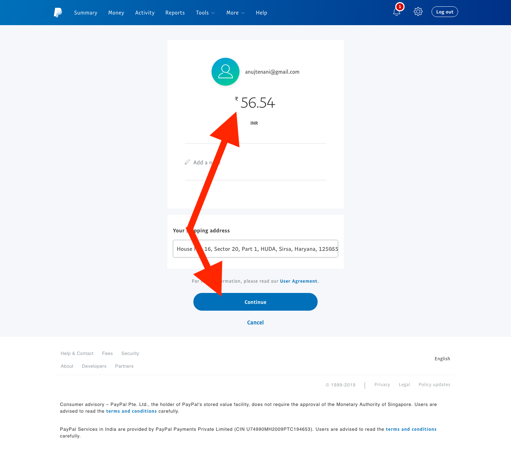

# Manually Pay With PayPal

### **Log in to your PayPal Account**

1. In the top bar select Tools > Send Payments.

&#x20; 2\.  Choose Send to Goods and Services (if you have a business account) or Send to friends or family (if you have a personal account, also fees are 0 if you choose this option)

&#x20; 3\.  Enter the PayPal email address of the affiliate (which gets displayed in the Payouts tab in GoAffPro).

&#x20; 4\.  On the next screen enter the amount (as mentioned in the payout screen).

&#x20;      Click on **Continue**, to confirm your payment.

### Mark the payment as paid in GoAffPro

1\. In the Payouts tab of the GoAffPro admin panel, start a payout session. Now, click on **Get Unpaid Transactions** > Select All > This will open up the payout summary section.

2\. After this, select the "**Pay the affiliates manually"** option > Click on **Mark as paid**.

<figure><figcaption>
Mark as paid
</figcaption></figure>

3\. Finally, click on **Create Payment Note**. This will mark the payment as paid.

<figure><figcaption>
Create Payment Note
</figcaption></figure>


[.](./)



#### **This process takes 1-2 minutes to pay an affiliate. If you have hundreds of affiliates, take a look at** [**PayPal's Payouts**](../setup-paypal-payouts/) **option.**&#x20;

