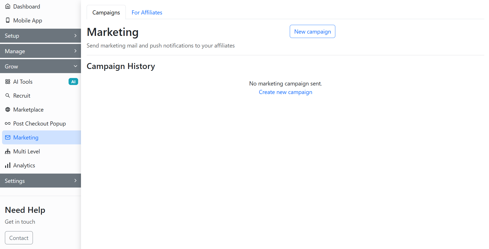

# Marketing

The **Marketing** tab allows you to set up email marketing campaigns for your affiliates. With the Email Marketing feature, you can create both bulk and drip email campaigns. This feature allows you to send emails to all affiliates at once and schedule them for future delivery. Additionally, you can view statistics related to your campaigns.

<figure><figcaption>
Marketing
</figcaption></figure>

You can click on **New campaign** to create a new email marketing campaign for your affiliates.

<figure><figcaption>
Marketing
</figcaption></figure>

Here, you can set up the campaign name and details. After this, you can select the campaign type.

.png>)

### Bulk Email

In the bulk email campaign, you can customize the email template, select the affiliates, and set the campaign schedule.&#x20;

.png>)

You can edit the email template as per your requirements.&#x20;

.png>)


[setup-email-marketing-campaigns](../../../affiliate-email/setup-email-marketing-campaigns/)


### Drip Email

In the drip email campaign, you can select the email trigger and add emails to the marketing campaign.&#x20;

.png>)

After adding the email, you can edit the email template and set it up for when it gets sent to affiliates.

.png>)

After setting up the email campaign, you can view its statistics, such as email opening and click tracking.

.png>)


[setup-drip-email-campaign.md](../../../affiliate-email/setup-email-marketing-campaigns/setup-drip-email-campaign.md)



Marketing


### Marketing CRM for Affiliates

In the For Affiliates section, you can give your affiliates access to the marketing CRM feature. It allows them to manage contacts and send email campaigns from their dashboard.&#x20;

Here, you can configure the marketing CRM access for affiliates and view their monthly email campaign usage statistics.

<figure><figcaption>
For Affiliates
</figcaption></figure>

Your affiliates can access and manage contacts through their dashboard. They can also create email campaigns and send them to their contacts or leads.​

<figure><figcaption>
Manage contacts &#x26; send emails
</figcaption></figure>


[enable-marketing-crm-for-affiliates.md](../../../affiliate-email/setup-email-marketing-campaigns/enable-marketing-crm-for-affiliates.md)



Marketing CRM for Affiliates

