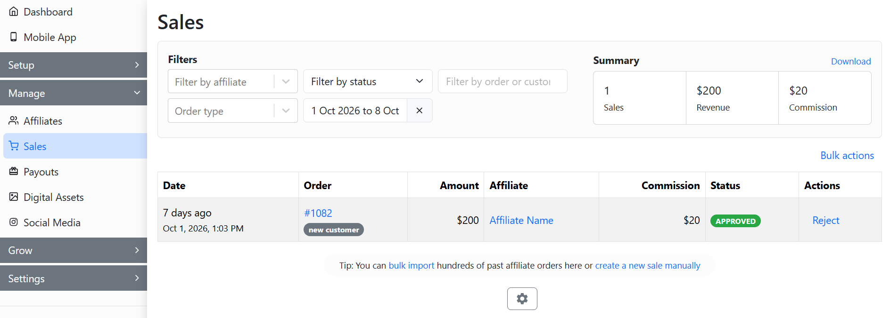

# Reprocessing Sales

**GoAffPro** provides you with the option to reprocess referral sales.

To reprocess referral sales, go to the **Sales** tab in the GoAffPro admin panel.

<figure><figcaption>
Sales
</figcaption></figure>

Here, click on **Reject**.

<figure><figcaption>
Click on Reject
</figcaption></figure>

Now, click on **Delete**.

<figure><figcaption>
Click on Delete
</figcaption></figure>

After this, click on **create a new sale manually**.

<figure><figcaption>
Click on create a new sale manually
</figcaption></figure>

&#x20;Next, select the order number and the affiliate.

<figure><figcaption>
Select order number and affiliate
</figcaption></figure>

Finally, click on **Assign Order**.

<figure><figcaption>
Click on Assign Order
</figcaption></figure>

After this, the reprocessed sale will appear in the Sales tab.

<figure><figcaption></figcaption></figure>


Reprocessing Sales

