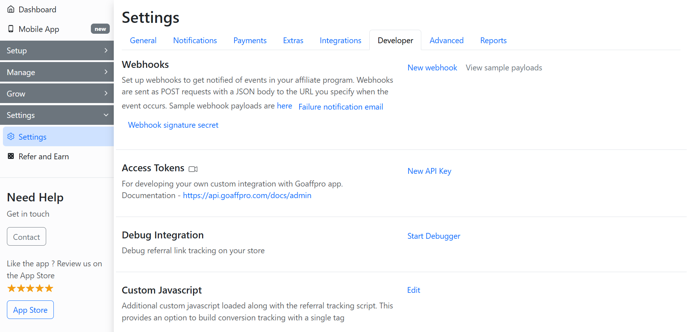

# Add Webhooks

**GoAffPro** provides you with the option to add webooks for custom programming.

To add webhooks for custom programming, go to the **Developer** section in the **Settings** tab of the GoAffPro admin panel.&#x20;

<figure><figcaption>
Settings > Developer
</figcaption></figure>

Here, go to the Webhooks section.

<figure><figcaption>
Webhooks
</figcaption></figure>

Now, click on **New webhook**.

<figure><figcaption>
Click on New webhook
</figcaption></figure>

This will open up the Add webhook window.

<figure><figcaption>
Add webhook
</figcaption></figure>

Here, you can set the topic and URL for the webhook.

<figure><figcaption></figcaption></figure>


Add Webhooks

