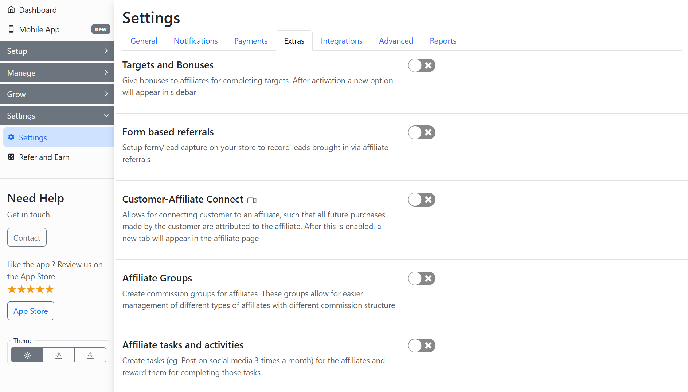

# Extra Settings

The **Extras** settings section allows you to configure and enable advanced features for your program. This includes options such as:

* [Setup Referral Forms](setup-referral-forms/)
  * [Create New Referral Form](setup-referral-forms/create-new-referral-form.md)
  * [Embed Referral Form in Affiliate Dashboard](setup-referral-forms/embed-referral-form-in-affiliate-dashboard.md)
* [Customer-Affiliate Connection](create-customer-affiliate-connection/)
  * [Bulk Import Customer Affiliate Connections](create-customer-affiliate-connection/bulk-import-customer-affiliate-connections/)
  * [Prevent Connections for Existing Customers](create-customer-affiliate-connection/prevent-connections-for-existing-customers.md)
  * [Create Affiliate Connections on Signup](create-customer-affiliate-connection/create-affiliate-connections-on-signup.md)&#x20;
* [Setup Affiliate Tasks & Activities](create-activities-for-affiliates/)
  * [Add Activity Page to Affiliate Dashboard](create-activities-for-affiliates/add-activity-page-to-affiliate-dashboard.md)
  * [Affiliate Activity Logging](create-activities-for-affiliates/affiliate-activity-logging.md)
  * [Manage Affiliate Activities](create-activities-for-affiliates/manage-affiliate-activities.md)
  * [Give Reward to Affiliates](create-activities-for-affiliates/give-reward-to-affiliates.md)
* [Setup Party Plans](setup-party-plans/)
  * [Add Order to Party](setup-party-plans/add-order-to-party.md)
* [Setup Affiliate Store](add-mini-store-to-affiliate-dashboard/setup-affiliate-store.md)
  * [Setup Special Products for Mini Store](add-mini-store-to-affiliate-dashboard/setup-special-products-for-mini-store.md)
  * [Affiliate Store Preview](add-mini-store-to-affiliate-dashboard/affiliate-store.md)
* [Setup Affiliate Public Store](setup-affiliate-public-store/)
  * [Generate Storefront Access Token](setup-affiliate-public-store/generate-storefront-access-token.md)
  * [Edit Public Store Theme](setup-affiliate-public-store/edit-public-store-theme.md)
  * [Affiliate Public Store Link](setup-affiliate-public-store/affiliate-public-store-link.md)
* [Setup Refer-A-Friend System](setup-refer-a-friend-system.md)
* [Send Products to Affiliates](send-products-to-affiliates.md)
* [W9 Form for Affiliates](w9-form-for-affiliates/)
  * [Mandatory W9 Form Requirement](w9-form-for-affiliates/mandatory-w9-form-requirement-for-affiliates.md)
* [Setup Membership Plans](setup-membership-plans/)
  * [Setup Payment Gateway](setup-membership-plans/setup-payment-gateway.md)
  * [Setup One Time Payment Plan](setup-membership-plans/setup-payment-plan.md)
  * [Setup Recurring Payment Plan](setup-membership-plans/setup-recurring-payment-plan.md)
  * [Setup Product Purchase Plan](setup-membership-plans/setup-product-purchase-plan.md)
  * [Disable Payment Plan](setup-membership-plans/disable-payment-plan.md)
  * [Affiliate Membership Activation](setup-membership-plans/affiliate-membership-activation.md)
  * [Membership Management Option](setup-membership-plans/membership-management-option-for-affiliates.md)
* [Affiliate Landing Page](create-a-new-affiliate-landing-page/)
  * [Approve/Reject Affiliate Landing Page](create-a-new-affiliate-landing-page/approve-reject-an-affiliates-landing-page.md)
* [Create Legal Documents](create-legal-documents/)
  * [Add Custom Fields to Legal Document](create-legal-documents/add-custom-fields-to-legal-document.md)
  * [Send Legal Document to Affiliate](create-legal-documents/send-legal-document-to-affiliate.md)
  * [Access Signed Legal Document](create-legal-documents/access-signed-legal-documents.md)
  * [Add Legal Document to Signup Page](create-legal-documents/add-legal-document-to-signup-page.md)
* [Add Store Metadata](add-store-metadata.md)

Go to the **Settings** > **Extras** section of the GoAffPro admin panel.

<figure><figcaption>
Settings > Extras
</figcaption></figure>
