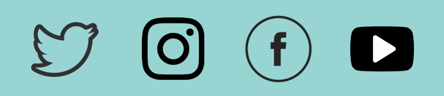

# Quick Setup

### Quick Setup

The program comes with default settings and can be used as is, however, we highly recommend going through the basic setup. There are 3 steps to it:

1. Set up the commission you want to give your affiliates.
2. Let your site visitors know you have an affiliate program.
3. Promote your affiliate program over your brand's social media handles.

### Setting up commissions on your products

By default, the app sets a **10% commission** on all your products. It means that when your customer makes a purchase using an affiliate's referral link or code, the affiliate earns a 10% commission on the sale.&#x20;

#### To change the commission rate:

In the GoAffPro admin panel, go to the **Commissions** tab.

<figure><figcaption>
Commissions
</figcaption></figure>

In the **Default Commission** section, click on the **Change.**

<figure><figcaption>
Default Commission > Click on Change
</figcaption></figure>

Set the new commission rate and click on **Save**.

<figure><figcaption>
Set the commission rate
</figcaption></figure>

Finally, click on **Save**.&#x20;

<figure><figcaption>
Click on Save
</figcaption></figure>

### Letting your site visitors know you have an affiliate program

You have multiple ways to let your visitors be aware of your affiliate program. Here, we will describe two methods:

* **Menu Link in Header or Footer Menu**
* **Custom Page with your program details**

#### Menu Link in Header or Footer

Having a link in your shop's header (top) or footer (bottom) menu allows quick access to the affiliate program for your store visitors. To create a menu link in Shopify:

Copy the affiliate portal link (for example https://helloworld.goaffpro.com)

<figure><figcaption>
Copy the affiliate portal link
</figcaption></figure>

Go to the Shopify admin panel > Online Store > Navigation > Main Menu section.

<figure><figcaption>
Shopify admin panel > Online Store > Navigation > Main Menu
</figcaption></figure>

Now, click on **Add menu item** > Set menu item name and link > Click on **Add**.

<figure><figcaption>
Add menu item > Set menu item name and link > Click on Add
</figcaption></figure>

Finally, click on **Save menu**.

<figure><figcaption>
Click on Save menu
</figcaption></figure>

**Check out our video guide below to see this process:**


Add Affiliate Portal Link in Store


#### Creating Custom Page with your program's details

Creating a custom page gives your affiliates a chance to review your program details before they decide to register for it. To create a custom page:

Go to the Shopify admin panel > Online Store > Pages > Click on **Add page**.

<figure><figcaption>
Shopify admin panel > Online Store > Pages > Click on Add page
</figcaption></figure>

Here, set the page title and content > Click on **Save**.

<figure><figcaption>
Set page title and content > Click on Save
</figcaption></figure>

### Promote your affiliate program on social media platforms

To build your affiliate network, start promoting your affiliate campaign on your Instagram and Facebook pages. More people joining your affiliate program will mean more promotion of your products and will increase sales.&#x20;


Social media platforms like Twitter, Instagram, Facebook, and YouTube are great for putting the word out about your affiliate program.



Simple Affiliate Program Setup

